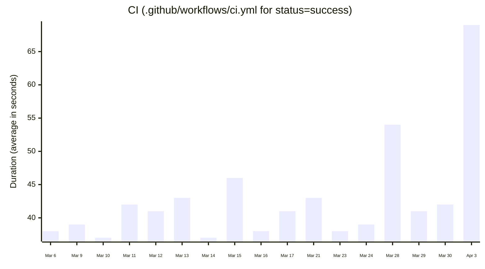

# GitHub Workflows Metrics

GitHub Workflows Metrics is a GitHub Action to measure duration of GitHub Workflows.
This will display charts for each GitHub Workflow, similar to the one shown below, on a GitHub issue.



## Motivation

When running CI with GitHub Actions, it's difficult to see the trend of GitHub workflow execution times.
Wouldn't it be easier to measure the results of efforts to shorten CI execution times
if this trend could be understood at a glance through a chart?
This Action was created with that motivation in mind.

## Usage

You should define a workflow like this:

```yaml
name: GitHub Workflows Metrics
on:
  workflow_dispatch:
  schedule:
    - cron: "30 10 * * *"
permissions:
  actions: read
  issues: write
jobs:
  metrics:
    runs-on: ubuntu-latest
    steps:
      - uses: yykamei/github-workflows-metrics@main
        with:
          only: ci.yml
          status: success
```

## Inputs

| Name      | Description                                                                                      | Required | Default                  |
|-----------|--------------------------------------------------------------------------------------------------|----------|--------------------------|
| range     | The range of time to measure the workflows. This can be: 7days, 14days, 30days                   | false    | 30days                   |
| aggregate | Determines how the workflow metrics should be aggregated. This can be: average, median, min, max | false    | average                  |
| only      | Only the specified workflows will be measured. This is supposed to be comma-separated list       | false    | ""                       |
| status    | Only the workflows with the specified status will be measured.                                   | false    | ""                       |
| label     | The label for GitHub issues that the GitHub Action creates                                       | false    | github-workflows-metrics |
| token     | The GitHub token used to create an authenticated client                                          | false    | ${{ github.token }}      |

## Contributing

Please take a look at the [CONTRIBUTING.md](CONTRIBUTING.md). It's always a pleasure to receive any contributions 😄
